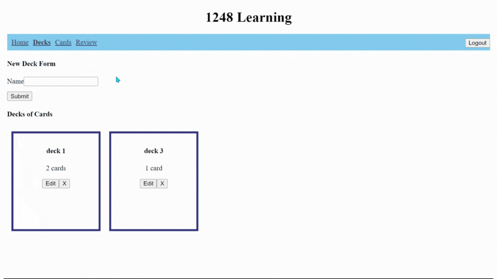

#1248 Learning

## Home

Spaced repitition is used here in order to enhance learning. Every time a card goes up a level, it will move a number of sessions forward so that it is reviewed less often. On the other hand, a card that is marked as wrong will appear more often. 

## Decks

Decks can be added, edited or deleted on this page.

## Cards

This is where a card can be created, deleted and viewed. When a card is viewed, it can be added to a deck, edited or edit a review. 

## Reviews

All cards in session 1 will be reviewed. If correct is selected, then the card will move to the next level and a number of sessions forward. If wrong is selected, then the card will change to level 1 and continue to be in the current review session until it is marked as correct. 

---

## Video Run-through
[Video](https://youtu.be/dtmvJrz8d6o)